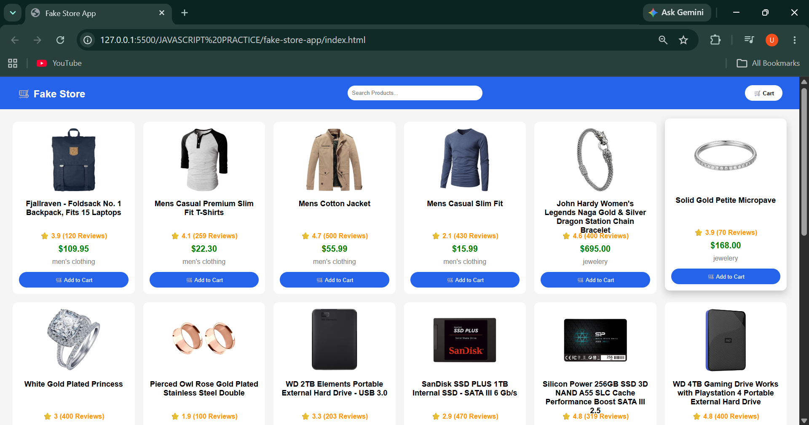

# 🛒 Fake Store App

A responsive e-commerce web application built using **HTML5, CSS3, and JavaScript**. This project demonstrates API integration, asynchronous programming using **Fetch API** and **Async/Await**, dynamic DOM manipulation, and responsive user interface design.

---

## 🚀 Features

- 📦 Fetches product data from the Fake Store API
- 🔍 Search products by title
- ⭐ Displays product ratings and review count
- 💲 Shows formatted product prices
- 📱 Fully responsive design for desktop and mobile devices
- ⚡ Uses Fetch API with Async/Await for asynchronous data fetching
- 🎨 Dynamically generates product cards using DOM Manipulation
- 🛡️ Handles API errors using Try/Catch
- 🛒 Clean, modern, and user-friendly interface

---

## 🛠️ Technologies Used

- HTML5
- CSS3
- JavaScript (ES6)
- Fetch API
- Async/Await
- DOM Manipulation

---

## 💡 Skills Demonstrated

- API Integration
- Asynchronous JavaScript
- DOM Manipulation
- Responsive Web Design
- Dynamic Content Rendering
- Error Handling
- Modern JavaScript (ES6)

---

## 📂 Project Structure

```text
fake-store-app/
│── index.html
│── style.css
│── script.js
│── README.md
└── screenshots/
    └── homepage.png
```

---

## ▶️ Getting Started

### 1. Clone the repository

```bash
git clone https://github.com/ravitejautti7/fake-store-app.git
```

### 2. Navigate to the project folder

```bash
cd fake-store-app
```

### 3. Run the project

Open `index.html` in your preferred web browser.

---

## 🌐 API Used

**Fake Store API**

- **Base URL:** https://fakestoreapi.com/
- **Products Endpoint:** https://fakestoreapi.com/products

The application fetches product data from the `/products` endpoint and dynamically renders it using JavaScript.

---

## 📸 Screenshot



---

## 🔗 Live Demo

**GitHub Repository**

👉 [https://github.com/ravitejautti7/fake-store-app](https://github.com/ravitejautti7/fake-store-app)

**Live Demo**

🚀 [https://ravitejautti7.github.io/fake-store-app/](https://ravitejautti7.github.io/fake-store-app/)

---

## 📚 What I Learned

While developing this project, I gained practical experience with:

- Working with REST APIs using the Fetch API
- Asynchronous programming using Async/Await
- DOM Manipulation
- Dynamic rendering of API data
- Error handling using Try/Catch
- Building responsive layouts using CSS Grid
- Writing clean and reusable JavaScript code

---

## 👨‍💻 Author

**Utti Raviteja**

- GitHub: https://github.com/ravitejautti7
- Email: ravitejautti@gmail.com

---

## 📄 License

This project was created for learning and educational purposes.

---

⭐ If you found this project helpful, consider giving it a star on GitHub!